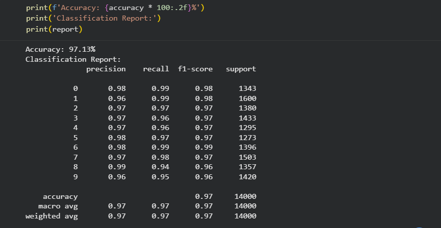
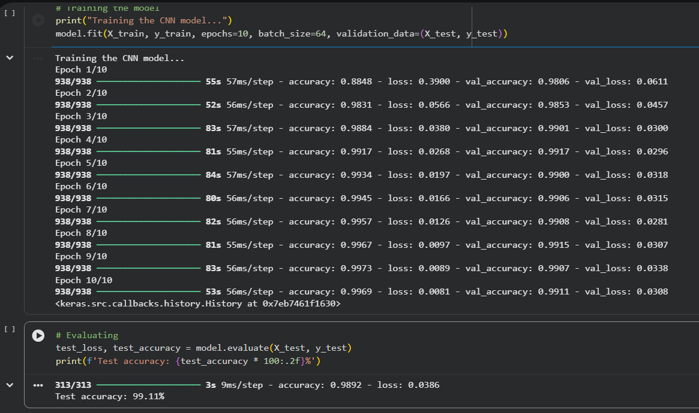

# MNIST Digit Recognition (KNN vs CNN)

## Project Overview

This project implements handwritten digit recognition using the MNIST dataset and compares two different approaches:

- K-Nearest Neighbors (KNN) as a classical machine learning baseline
- Convolutional Neural Network (CNN) as a deep learning model

The goal is to classify digits (0–9) and analyze performance differences between traditional ML and deep learning methods.


## Dataset

- MNIST handwritten digit dataset
- 70,000 grayscale images
- Image size: 28 × 28 pixels
- 10 classes (digits 0–9)


## Method 1: K-Nearest Neighbors (KNN)

### Description
A simple instance-based learning algorithm used as a baseline classifier.

### Steps
- Load MNIST dataset
- Normalize pixel values
- Split into train/test sets
- Train KNN classifier (k=3)
- Evaluate performance

### KNN Result

- **Accuracy:** 97.13%




## Method 2: Convolutional Neural Network (CNN)

### Description
A deep learning model designed for image classification using convolutional layers.

### Architecture

- Conv2D (32 filters)
- MaxPooling2D
- Conv2D (64 filters)
- MaxPooling2D
- Flatten
- Dense (64 neurons)
- Output Layer (Softmax, 10 classes)

### Steps
- Load MNIST dataset
- Normalize images
- One-hot encode labels
- Train CNN model
- Evaluate performance

### CNN Result

- **Test Accuracy:** 99.11%



## Comparison

| Model | Accuracy |
|------|---------|
| KNN  | 97.13%  |
| CNN  | 99.11%  |


## Key Insight

CNN outperforms KNN due to:
- Better feature extraction (convolutions)
- Spatial awareness in images
- Ability to learn hierarchical patterns


## Technologies Used

- Python
- NumPy
- Scikit-learn
- TensorFlow / Keras


## How to Run

### KNN Model
```bash
python knn_classifier.py
```

### CNN Model
```bash
python cnn_classifier.py
```


## Conclusion

This project demonstrates that deep learning (CNN) significantly outperforms traditional machine learning (KNN) for image classification tasks such as handwritten digit recognition.


## 👤 Author

**Fateme Khosravi**
Computer Science Graduate | Interested in Data Science, Algorithms, and Systems Analysis

